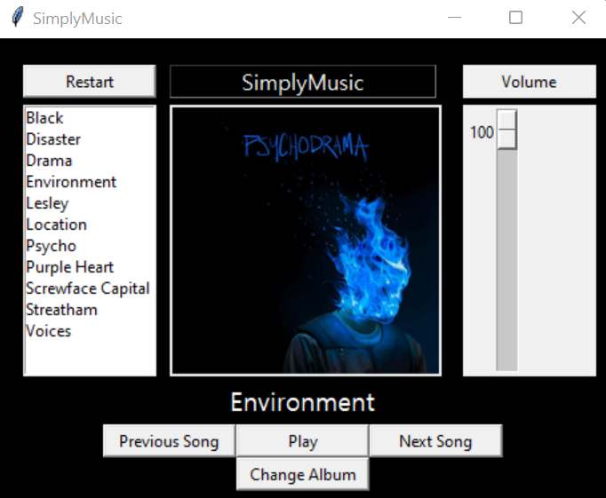

# SimplyMusic
A simple music player, powered by Python, utilising various libraries such as Tkinter and Pygame

Features:
- Play Song
- Previous Song
- Next Song
- Skip to specific song (from box on left)
- Cover Art of Album
- Volume Control
- Album Selector (folder selector)
- Restart Song

Repositories:
- Tkinter
- Pygame
- Pillow

Prerequisites:
- A folder, containing mp3 files, and, if possible, a png file (usually of the album cover)

How does it work?
- Upon opening the file, you are prompted to select a folder and you must select the folder containing your mp3 files
- You will then be presented with a GUI, allowing you to control the music

Notes:
- Currently, the next song doesn't play upon the previous songs completion, I am working on this 
- Also attempting to work on adding a song slider and time elapsed section
- The music player was built as part of an RFID Music Player on a Raspberry Pi project
